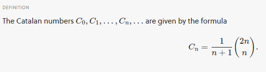
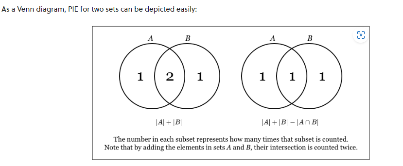

# **Pigeon Hole**
    Suppose that a flock of 20 pigeons flies into a set of 19 pigeonholes to roost. Because there are 20 pigeons but only 19 pigeonholes, at least one of these 19 pigeonholes must have at least two pigeons in it. To see why this is true, note that if each pigeonhole had at most one pigeon in it, at most 19 pigeons, one per hole, could be accommodated. This illustrates a general principle called the pigeonhole principle, which states that if there are more pigeons than pigeonholes, then there must be at least one pigeonhole with at least two pigeons in it. 

    ==> In simple words
    In Discrete Mathematics, the pigeonhole principle states that if we must put N + 1 or more pigeons into N Pigeon Holes, then some pigeonholes must contain two or more pigeons.

## Applications

    This principle is applicable in many fields like Number Theory, Probability, Algorithms, Geometry, etc.

    ==> Problem 1
    A bag contains beads of two colours: black and white. What is the smallest number of beads which must be drawn from the bag, without looking so that among these beads, two are of the same colour?

    ==> Problem 2
    Find the minimum number of students in a class such that three of them are born in the same month?

    ==> Problem 3
    If n is a positive integer not divisible by 2 or 5 then n has a multiple made up of 1's.

    etc...

---
 
 

# **Catalan Numbers**
    The Catalan numbers are a sequence of positive integers that appear in many counting problems in combinatorics. They count certain types of lattice paths, permutations, binary trees, and many other combinatorial objects. They satisfy a fundamental recurrence relation, and have a closed-form formula in terms of binomial coefficients.

    The first few Catalan Numbers are:
    C0 = 1
    C1 = 1
    C2 = 2
    C3 = 5
    C4 = 14
    C5 = 42

    Mathematical derivation of numbers: 
    C(0) = C(1) = 1 // always start from here
    C(2) = C0*C1 + C1*C0 = 1*1 + 1*1 = 2
    C(3) = C0*C2 + C1*C1 + C2*C0 = 2 + 1 + 2 = 5
    C(4) = C0*C3 + C1*C2 + C2*C1 + C3*C0 = 5 + 2 + 2 + 5 = 14
    .
    .
    .
    .
    .
    C(N) = C0*C(N-1) + C1*C(N-2) + ...... + Ci*C(N-i-1) + ....... + C(N-1)*C0

---
 
 

# **Principle of Inclusion and Exclusion (PIE)**
    The principle of inclusion and exclusion (PIE) is a counting technique that computes the number of elements that satisfy at least one of several properties while guaranteeing that elements satisfying more than one property are not counted twice.

    An underlying idea behind PIE is that summing the number of elements that satisfy at least one of two categories and subtracting the overlap prevents double counting. For instance, the number of people that have at least one cat or at least one dog can be found by taking the number of people who own a cat, adding the number of people that have a dog, then subtracting the number of people who have both.

    PIE is particularly useful in combinatorics and probability problem solving when it is necessary to devise a counting method that ensures an object is not counted twice.

## Example
    In the case of objects being separated into two (possibly disjoint) sets, the principle of inclusion and exclusion states

 ∣A∪B∣=∣A∣+∣B∣−∣A∩B∣    

    
    where ∣s∣ denotes the cardinality, or number of elements, of set S in set notation.

### Proof
    To prove this statement, we will show that every element which belongs in one of these sets is counted exactly once, and every element that is not in these sets is counted exactly zero times.

    - Case 1. Element is not in A, and not in B.It is obvious it is counted zero times in the LHS. It is obvious it is counted zero times in the RHS.

    - Case 2. Element is in A, and not in B. It will be counted once on the LHS. On the RHS, it is counted once in ∣A∣.

    - Case 3. Element is not in A, and is in B. It will be counted once on the LHS. On the RHS, it is counted once in ∣B∣.

    - Case 4. Element is in A, and in B. It will be counted once on the LHS. On the RHS, it is counted +1 in ∣A∣, +1 in ∣B∣ and −1 in ∣A∩B∣. Hence, it is counted exactly once.

